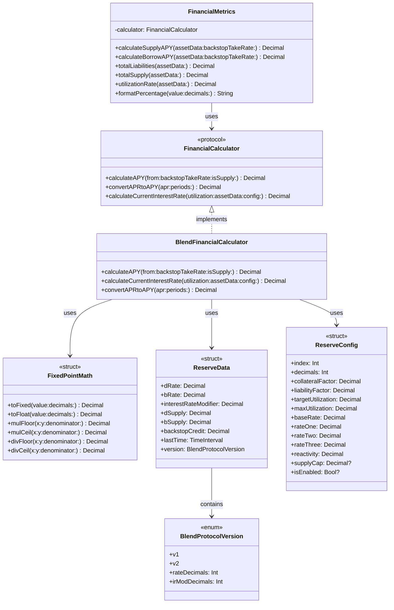

# Blend Financial Calculator Documentation


**Version:** 1.0.0  
**Last Updated:** May 31, 2025  
**Status:** Production-Ready

## Table of Contents

- [Executive Summary](#executive-summary)
- [Architecture Overview](#architecture-overview)
  - [Core Components](#core-components)
  - [Data Flow](#data-flow)
- [API Reference](#api-reference)
  - [FinancialCalculator Protocol](#financialcalculator-protocol)
  - [BlendFinancialCalculator](#blendfinancialcalculator)
  - [FinancialMetrics](#financialmetrics)
  - [Data Structures](#data-structures)
  - [Fixed-Point Math Utilities](#fixed-point-math-utilities)
- [Implementation Details](#implementation-details)
  - [APY/APR Calculation Methodology](#apyapr-calculation-methodology)
  - [Precision Handling](#precision-handling)
  - [Version-Specific Behavior](#version-specific-behavior)
  - [Error Handling and Edge Cases](#error-handling-and-edge-cases)
- [Configuration](#configuration)
  - [Requirements](#requirements)
  - [Installation](#installation)
  - [Dependencies](#dependencies)
- [Usage Examples](#usage-examples)
  - [Basic APY Calculation](#basic-apy-calculation)
  - [Advanced Usage](#advanced-usage)
  - [Integration with Soroban Contract Data](#integration-with-soroban-contract-data)
- [Performance Considerations](#performance-considerations)
- [Troubleshooting](#troubleshooting)
- [Maintenance and Updates](#maintenance-and-updates)

## Executive Summary

The Blend Financial Calculator is a Swift implementation of the Blend Protocol's financial calculation system. It provides precise, reliable calculations for Annual Percentage Yield (APY) and Annual Percentage Rate (APR) for both supply and borrow positions in the protocol.

### Key Capabilities

- **High-Precision Calculations**: Uses Swift's `Decimal` type for accurate financial math
- **Protocol-Based Design**: Flexible architecture with clear interfaces
- **Comprehensive Financial Metrics**: Complete set of calculations for reserve analysis
- **Version Support**: Handles both V1 and V2 versions of the Blend Protocol
- **Edge Case Handling**: Robust handling of extreme scenarios with appropriate bounds

This implementation is an exact match for the calculation methodology used in the JavaScript SDK, ensuring consistent results across platforms while leveraging Swift's strong type system and performance benefits.

## Architecture Overview

The Blend Financial Calculator is designed with a protocol-oriented approach, emphasizing type safety, immutability, and clear separation of concerns.

### Core Components



### Data Flow

The system follows a clear data flow for APY/APR calculations:

1. **Input**: Reserve data, backstop take rate, and calculation type (supply/borrow)
2. **Processing**:
   - Calculate utilization rate from reserve data
   - Determine interest rate based on utilization and reserve configuration
   - Convert interest rate to APR considering supply capture for supply calculations
   - Convert APR to APY using the appropriate compounding period
3. **Output**: The final APY as a Decimal value

## API Reference

### FinancialCalculator Protocol

The core interface defining financial calculation capabilities.

```swift
protocol FinancialCalculator {
    /// Calculates APY from asset data
    /// - Parameters:
    ///   - assetData: Asset reserve data
    ///   - backstopTakeRate: Backstop take rate as a fixed-point decimal
    ///   - isSupply: True for supply APY, false for borrow APY
    /// - Returns: The calculated APY as a Decimal
    func calculateAPY(from assetData: ReserveData, backstopTakeRate: Decimal, isSupply: Bool) -> Decimal
    
    /// Converts APR to APY
    /// - Parameters:
    ///   - apr: Annual Percentage Rate
    ///   - periods: Number of compounding periods per year
    /// - Returns: Annual Percentage Yield
    func convertAPRtoAPY(_ apr: Decimal, periods: Int) -> Decimal
    
    /// Calculates current interest rate based on utilization
    /// - Parameters:
    ///   - utilization: Current utilization rate
    ///   - assetData: Asset reserve data
    ///   - config: Reserve configuration
    /// - Returns: The calculated interest rate
    func calculateCurrentInterestRate(utilization: Decimal, assetData: ReserveData, config: ReserveConfig) -> Decimal
}
```

### BlendFinancialCalculator

The primary implementation of the `FinancialCalculator` protocol.

| Method | Description | Parameters | Return Type |
|--------|-------------|------------|-------------|
| `calculateAPY` | Calculates APY from reserve data | `assetData`: ReserveData<br>`backstopTakeRate`: Decimal<br>`isSupply`: Bool | `Decimal` |
| `calculateCurrentInterestRate` | Calculates interest rate based on utilization | `utilization`: Decimal<br>`assetData`: ReserveData<br>`config`: ReserveConfig | `Decimal` |
| `convertAPRtoAPY` | Converts APR to APY using compound interest formula | `apr`: Decimal<br>`periods`: Int | `Decimal` |

### FinancialMetrics

High-level container for financial metrics calculations.

| Method | Description | Parameters | Return Type |
|--------|-------------|------------|-------------|
| `calculateSupplyAPY` | Calculates supply APY | `assetData`: ReserveData<br>`backstopTakeRate`: Decimal | `Decimal` |
| `calculateBorrowAPY` | Calculates borrow APY | `assetData`: ReserveData<br>`backstopTakeRate`: Decimal | `Decimal` |
| `totalLiabilities` | Calculates total liabilities for a reserve | `assetData`: ReserveData | `Decimal` |
| `totalSupply` | Calculates total supply for a reserve | `assetData`: ReserveData | `Decimal` |
| `utilizationRate` | Calculates utilization rate for a reserve | `assetData`: ReserveData | `Decimal` |
| `formatPercentage` | Formats a decimal as a percentage string | `value`: Decimal<br>`decimals`: Int | `String` |

### Data Structures

#### ReserveConfig

Contains configuration for a reserve asset.

| Property | Type | Description |
|----------|------|-------------|
| `index` | `Int` | Index of the reserve in the pool |
| `decimals` | `Int` | Decimal precision for the asset |
| `collateralFactor` | `Decimal` | Factor applied to collateral value (c_factor) |
| `liabilityFactor` | `Decimal` | Factor applied to liability value (l_factor) |
| `targetUtilization` | `Decimal` | Target utilization rate |
| `maxUtilization` | `Decimal` | Maximum utilization rate |
| `baseRate` | `Decimal` | Base interest rate (r_base) |
| `rateOne` | `Decimal` | Rate parameter one (r_one) |
| `rateTwo` | `Decimal` | Rate parameter two (r_two) |
| `rateThree` | `Decimal` | Rate parameter three (r_three) |
| `reactivity` | `Decimal` | Interest rate reactivity parameter |
| `supplyCap` | `Decimal?` | Optional cap on total supply (V2 only) |
| `isEnabled` | `Bool?` | Optional flag indicating if reserve is enabled (V2 only) |

#### ReserveData

Contains current state data for a reserve.

| Property | Type | Description |
|----------|------|-------------|
| `dRate` | `Decimal` | Exchange rate for debt tokens (dTokens) |
| `bRate` | `Decimal` | Exchange rate for supply tokens (bTokens) |
| `interestRateModifier` | `Decimal` | Modifier applied to interest rates |
| `dSupply` | `Decimal` | Total supply of debt tokens |
| `bSupply` | `Decimal` | Total supply of supply tokens |
| `backstopCredit` | `Decimal` | Credit allocated to backstop |
| `lastTime` | `TimeInterval` | Timestamp of last update |
| `version` | `BlendProtocolVersion` | Protocol version for this reserve |

#### BlendProtocolVersion

Enumeration of Blend Protocol versions with version-specific settings.

```swift
enum BlendProtocolVersion {
    case v1
    case v2
    
    var rateDecimals: Int {
        switch self {
        case .v1: return 9
        case .v2: return 12
        }
    }
    
    var irModDecimals: Int {
        switch self {
        case .v1: return 9
        case .v2: return 7
        }
    }
}
```

### Fixed-Point Math Utilities

Utilities for fixed-point arithmetic calculations.

| Method | Description | Parameters | Return Type |
|--------|-------------|------------|-------------|
| `toFixed` | Converts floating-point to fixed-point | `value`: Decimal<br>`decimals`: Int | `Decimal` |
| `toFloat` | Converts fixed-point to floating-point | `value`: Decimal<br>`decimals`: Int | `Decimal` |
| `mulFloor` | Multiplies with floor division | `x`: Decimal<br>`y`: Decimal<br>`denominator`: Decimal | `Decimal` |
| `mulCeil` | Multiplies with ceiling division | `x`: Decimal<br>`y`: Decimal<br>`denominator`: Decimal | `Decimal` |
| `divFloor` | Divides with floor | `x`: Decimal<br>`y`: Decimal<br>`denominator`: Decimal | `Decimal` |
| `divCeil` | Divides with ceiling | `x`: Decimal<br>`y`: Decimal<br>`denominator`: Decimal | `Decimal` |

## Implementation Details

### APY/APR Calculation Methodology

The calculation follows the Blend Protocol's official methodology, which implements a three-tier interest rate model based on utilization:

1. **Below Target Utilization**:
   ```swift
   let utilScalar = utilization / targetUtil
   let baseRate = (utilScalar * rateOne) + baseRate
   let currentIR = baseRate * interestRateModifier
   ```

2. **Between Target and 95% Utilization**:
   ```swift
   let utilScalar = (utilization - targetUtil) / (0.95 - targetUtil)
   let baseRate = (utilScalar * rateTwo) + rateOne + baseRate
   let currentIR = baseRate * interestRateModifier
   ```

3. **Above 95% Utilization**:
   ```swift
   let utilScalar = (utilization - 0.95) / 0.05
   let extraRate = utilScalar * rateThree
   let intersection = interestRateModifier * (rateTwo + rateOne + baseRate)
   let currentIR = extraRate + intersection
   ```

The APR calculation then differs between supply and borrow:

- **Borrow APR**: Directly uses the calculated interest rate
- **Supply APR**: Applies the backstop take rate and utilization:
  ```swift
  let supplyCapture = (1 - backstopTakeRate) * utilization
  let supplyRate = currentIR * supplyCapture
  ```

Finally, APR is converted to APY using the compound interest formula:
```swift
APY = (1 + APR/n)^n - 1
```
Where `n` is 52 for supply (weekly compounding) and 365 for borrow (daily compounding).

### Precision Handling

The implementation uses Swift's `Decimal` type for financial calculations to avoid floating-point precision issues. Fixed-point arithmetic is used with specific scalar values:

- `SCALAR_7`: 10^7 (7 decimal places)
- `SCALAR_9`: 10^9 (9 decimal places)
- `SCALAR_12`: 10^12 (12 decimal places)

Different protocol versions use different precision settings:
- V1: Rate decimals = 9, IR modifier decimals = 9
- V2: Rate decimals = 12, IR modifier decimals = 7

### Version-Specific Behavior

The implementation handles both V1 and V2 versions of the Blend Protocol through the `BlendProtocolVersion` enum, which provides the appropriate decimal precision for each version:

```swift
enum BlendProtocolVersion {
    case v1
    case v2
    
    var rateDecimals: Int {
        switch self {
        case .v1: return 9
        case .v2: return 12
        }
    }
    
    var irModDecimals: Int {
        switch self {
        case .v1: return 9
        case .v2: return 7
        }
    }
}
```

### Error Handling and Edge Cases

The implementation addresses several edge cases:

- **Zero Supply or Liabilities**: Returns 0 for APY calculations
- **Negative APR Values**: Returns 0
- **Extremely High Rates**: Caps maximum APR at 10.0 (1000%) and maximum APY at 100.0 (10000%)
- **Invalid Compounding Periods**: Returns 0 if periods ≤ 0

## Configuration

### Requirements

- Swift 6.0+
- iOS 15.0+ / macOS 12.0+
- Xcode 15.0+

### Installation

#### Manual Integration

1. Add `BlendFinancialCalculator.swift` to your project.
2. Import in any file where you need to use it.

#### Swift Package Manager (if published)

Add the following dependency to your `Package.swift` file:

```swift
.package(url: "https://github.com/blend-protocol/blend-financial-calculator-swift.git", from: "1.0.0")
```

### Dependencies

- **Foundation Framework**: Required for `Decimal` support
- No external dependencies

## Usage Examples

### Basic APY Calculation

```swift
import Foundation

// Create a financial metrics calculator
let metrics = FinancialMetrics()

// Sample reserve data
let reserveData = ReserveData(
    dRate: 1.02 * FixedPointMath.scalar9,
    bRate: 1.01 * FixedPointMath.scalar9,
    interestRateModifier: 1.0 * FixedPointMath.scalar7,
    dSupply: 1000000 * FixedPointMath.scalar7,
    bSupply: 2000000 * FixedPointMath.scalar7,
    backstopCredit: 0,
    lastTime: Date().timeIntervalSince1970,
    version: .v2
)

// Calculate APYs
let backstopTakeRate = 0.2 * FixedPointMath.scalar7 // 20%
let supplyAPY = metrics.calculateSupplyAPY(assetData: reserveData, backstopTakeRate: backstopTakeRate)
let borrowAPY = metrics.calculateBorrowAPY(assetData: reserveData, backstopTakeRate: backstopTakeRate)

// Format as percentages
print("Supply APY: \(metrics.formatPercentage(supplyAPY))")
print("Borrow APY: \(metrics.formatPercentage(borrowAPY))")
```

### Advanced Usage

```swift
// Create a custom reserve configuration
let config = ReserveConfig(
    index: 0,
    decimals: 7,
    collateralFactor: 0.9,
    liabilityFactor: 0.9,
    targetUtilization: 0.8,
    maxUtilization: 0.95,
    baseRate: 0.02,
    rateOne: 0.08,
    rateTwo: 0.2,
    rateThree: 2,
    reactivity: 0.5,
    supplyCap: nil,
    isEnabled: nil
)

// Access the calculator directly for custom calculations
let calculator = BlendFinancialCalculator()

// Calculate utilization manually
let totalLiabilities = FixedPointMath.mulFloor(
    reserveData.dSupply,
    reserveData.dRate,
    FixedPointMath.scalar9
)
let totalSupply = reserveData.bSupply
let utilization = FixedPointMath.divFloor(
    totalLiabilities,
    totalSupply + totalLiabilities,
    FixedPointMath.scalar7
)

// Calculate interest rate manually
let interestRate = calculator.calculateCurrentInterestRate(
    utilization: utilization,
    assetData: reserveData,
    config: config
)

print("Current Interest Rate: \(FixedPointMath.toFloat(interestRate, decimals: 7) * 100)%")
```

### Integration with Soroban Contract Data

```swift
// Example of integrating with Soroban contract data
// Assuming you have fetched raw data from a Soroban RPC call

// Convert contract data to ReserveData
func createReserveDataFromContractData(contractData: [String: Any]) -> ReserveData? {
    guard let dRateRaw = contractData["dRate"] as? String,
          let bRateRaw = contractData["bRate"] as? String,
          let irModRaw = contractData["irMod"] as? String,
          let dSupplyRaw = contractData["dSupply"] as? String,
          let bSupplyRaw = contractData["bSupply"] as? String,
          let backstopCreditRaw = contractData["bCredit"] as? String,
          let lastTimeRaw = contractData["lastTime"] as? UInt64 else {
        return nil
    }
    
    // Convert string representations to Decimal
    guard let dRate = Decimal(string: dRateRaw),
          let bRate = Decimal(string: bRateRaw),
          let irMod = Decimal(string: irModRaw),
          let dSupply = Decimal(string: dSupplyRaw),
          let bSupply = Decimal(string: bSupplyRaw),
          let backstopCredit = Decimal(string: backstopCreditRaw) else {
        return nil
    }
    
    return ReserveData(
        dRate: dRate,
        bRate: bRate,
        interestRateModifier: irMod,
        dSupply: dSupply,
        bSupply: bSupply,
        backstopCredit: backstopCredit,
        lastTime: TimeInterval(lastTimeRaw),
        version: .v2 // Determine version based on contract data
    )
}

// Usage example
func fetchAndCalculateAPYs(assetId: String, oracleContractId: String) async {
    // Fetch contract data from Soroban (pseudo-code)
    // let contractData = await fetchReserveData(assetId: assetId)
    
    // Mock contract data for example
    let mockContractData: [String: Any] = [
        "dRate": "1020000000",
        "bRate": "1010000000",
        "irMod": "10000000",
        "dSupply": "100000000000",
        "bSupply": "200000000000",
        "bCredit": "0",
        "lastTime": UInt64(Date().timeIntervalSince1970)
    ]
    
    // Convert to ReserveData
    guard let reserveData = createReserveDataFromContractData(contractData: mockContractData) else {
        print("Failed to parse contract data")
        return
    }
    
    // Calculate APYs
    let metrics = FinancialMetrics()
    let backstopTakeRate = 0.2 * FixedPointMath.scalar7 // 20%
    
    let supplyAPY = metrics.calculateSupplyAPY(assetData: reserveData, backstopTakeRate: backstopTakeRate)
    let borrowAPY = metrics.calculateBorrowAPY(assetData: reserveData, backstopTakeRate: backstopTakeRate)
    
    print("Asset: \(assetId)")
    print("Supply APY: \(metrics.formatPercentage(supplyAPY))")
    print("Borrow APY: \(metrics.formatPercentage(borrowAPY))")
}
```

## Performance Considerations

1. **Decimal Precision**: The `Decimal` type is used for all financial calculations to avoid floating-point precision issues common with `Double`.

2. **Memory Optimization**: All data structures are value types (structs) to minimize memory overhead and provide immutability benefits.

3. **Calculation Efficiency**:
   - The implementation avoids unnecessary calculations by returning early for edge cases.
   - Fixed-point arithmetic operations are optimized to minimize conversions.

4. **Thread Safety**: All components are designed to be thread-safe with no shared mutable state.

## Troubleshooting

### Common Issues

| Issue | Possible Cause | Solution |
|-------|---------------|----------|
| APY calculations return 0 | Zero supply or liability values | Ensure reserve data has non-zero values for dSupply and bSupply |
| Extremely high APY values | Very high utilization or incorrect rate parameters | Verify utilization is within expected range and rate parameters are correct |
| Inconsistent results between platforms | Different precision handling | Ensure fixed-point arithmetic matches exactly between platforms |
| Incorrect scale in calculations | Wrong scalar used | Double-check scalar usage matches the protocol version |

### Validation

To validate your calculations against the JavaScript SDK:

1. Run the same calculation with identical inputs in both systems.
2. Compare the outputs to ensure they match within the expected precision tolerance (typically within 0.0001%).
3. If discrepancies exist, check the scalar values and rounding modes.

## Maintenance and Updates

### Version History

| Version | Release Date | Changes |
|---------|--------------|---------|
| 1.0.0   | May 31, 2025 | Initial implementation |

### Update Procedure

1. **Identify Changes**: Monitor the Blend Protocol for updates to the calculation methodology.
2. **Review Impact**: Assess the impact of changes on existing calculations.
3. **Update Implementation**: Modify the Swift implementation to match the new methodology.
4. **Test**: Validate against reference implementations to ensure consistency.
5. **Documentation**: Update this documentation to reflect changes.

### Contact & Support

For issues, questions, or contributions, please contact the Blend Protocol team:

- GitHub: [github.com/blend-protocol](https://github.com/blend-protocol)
- Email: support@blendprotocol.com

---

© 2025 Blend Protocol. All rights reserved.
